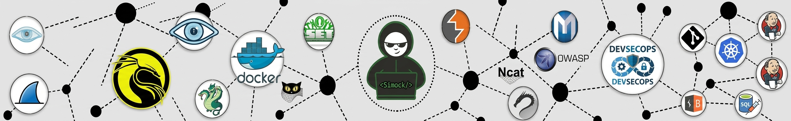

### Hey, I'm Dje BI . I'm student in :

**AI | Cybersecurity | Building the Future of Intelligent Security**

---

## What I'm Building

During my last internship in August 2026, I worked on “Automating the Bid Submission Process Using Artificial Intelligence.”

## The Intersection Where I Operate

The premise is straightforward: effective defense requires understanding systems at a depth that traditional approaches cannot achieve. LLMs don't merely detect patterns; they can reason about context, intent, and anomaly. That capability is the next frontier of security, and I'm building toward it.

---

## Tech Arsenal

### AI & Machine Learning

<table>
<tr>
<td width="50%" valign="top">

**Languages & Core**

</td>
<td width="50%" valign="top">

**Frameworks**

</td>
</tr>
<tr>
<td width="50%" valign="top">

**LLMs & Models**

`Fine-tuning` `Prompt Engineering` `RLHF`

</td>
<td width="50%" valign="top">

**RAG & Vector Systems**

`Embeddings` `Semantic Search` `Retrieval Augmentation`

</td>
</tr>
</table>

**Computer Vision**

`Real-time Detection` `Facial Landmarks` `Pattern Recognition`

---

### Backend & Infrastructure

<table>
<tr>
<td width="33%" align="center">

**Languages**

</td>
<td width="33%" align="center">

**Frameworks**

</td>
<td width="33%" align="center">

**Cloud & DevOps**

</td>
</tr>
</table>

`RESTful APIs` `Microservices` `AWS SageMaker` `Lambda` `Serverless Architecture`

---

### Cybersecurity

<table>
<tr>
<td width="50%" valign="top">

**Languages & Scripting**

</td>
<td width="50%" valign="top">

**Operating Systems**

</td>
</tr>

<tr>
<td width="50%" valign="top">

**Network Security**

`Network Analysis` `Traffic Inspection` `Port Scanning`

</td>
<td width="50%" valign="top">

**Web Security**

`API Security` `Web Pentesting` `OWASP Top 10`

</td>
</tr>
</table>

**Penetration Testing**

`Vulnerability Assessment` `Privilege Escalation` `Password Auditing`

---

### Security Infrastructure

<table>
<tr>
<td width="33%" align="center">

**Virtualization**

</td>
<td width="33%" align="center">

**Containers & Services**

</td>
<td width="33%" align="center">

**Databases**

</td>
</tr>
</table>

---

### Security Practices

`Penetration Testing` `Vulnerability Assessment` `Network Security` `Web Security`

`CTF Player` `OSINT` `Digital Forensics` `Incident Response`

`Linux Hardening` `Active Directory` `Threat Hunting` `Secure Coding`

---

## Featured Projects

### Nylah - AI Companion System `[Active Development]`

An advanced AI assistant designed to go beyond conversational interfaces. The architecture combines natural language understanding, autonomous task execution, and multi-modal processing with a coherent personality layer.

**Core Capabilities:**
- Contextual reasoning and memory persistence
- Task decomposition and autonomous execution
- Multi-modal input processing (text, voice, vision)
- Adaptive personality and communication style

**Stack:** `Python` `LLMs` `RAG` `Vector DBs` `FastAPI` `Multi-modal AI`

**Status:** Private repository. Public release planned.

---

<table>
<tr>
<td width="50%" valign="top">

### RAG-Fusion with GPT-4o

Hybrid retrieval architecture combining dense and sparse methods for domain-specific knowledge injection. Focus on eliminating hallucinations while maintaining contextual depth.

**Objective:** Retrieval that comprehends, not just matches.

</td>
<td width="50%" valign="top">

### Drowsiness Detection System

Real-time computer vision system for driver safety monitoring. Implements facial landmark detection and eye-state analysis using optimized YOLO models.

**Application:** Preventing fatigue-related accidents through proactive alerts.

</td>
</tr>
<tr>
<td width="50%" valign="top">

### Automated Job Application Pipeline

AI-driven automation for job applications. Handles form parsing, intelligent field mapping, and submission across multiple platforms.

**Rationale:** Repetitive tasks should be automated. Always.

</td>
<td width="50%" valign="top">

### LLM Fine-tuning Framework

End-to-end pipeline for domain adaptation of language models. Includes data quality validation, training optimization, and evaluation metrics.

**Focus:** Ensuring models learn precisely what you intend.

</td>
</tr>
<tr>
<td width="50%" valign="top">

### n8n Workflow Automation Suite

Intelligent automation systems connecting productivity tools: Gmail, Telegram, Drive, Slack, and custom APIs. Orchestrated workflows for process optimization.

</td>
<td width="50%" valign="top">

### F2F Translation Engine

French to Fongbe translation system. Contributing to language preservation through accessible technology.

**Mission:** Keeping languages alive in the digital era.

</td>
</tr>
</table>

---

## GitHub Analytics

<table>
<tr>
<td width="50%" align="center">

</td>
<td width="50%" align="center">

</td>
</tr>
</table>

  

---

## Operating Principles

> *"The best security systems don't just react - they understand. The best AI doesn't just process - it reasons. I'm building both."*

<table>
<tr>
<td width="20%" align="center">

**Learning in Public**

Sharing progress, including failures.

</td>
<td width="20%" align="center">

**Security Through Understanding**

Not obscurity.

</td>
<td width="20%" align="center">

**AI as Augmentation**

Extending human capability, not replacing it.

</td>
<td width="20%" align="center">

**Strategic Openness**

Open source when beneficial, closed when necessary.

</td>
<td width="20%" align="center">

**Sustained Focus**

Coffee is infrastructure.

</td>
</tr>
</table>

---

## Connect

Building something interesting? Working on AI or security challenges? Open to collaboration and technical discussions.

 

 

| Contact | Address |
|:--------|:--------|
| Academic | bitrazieenock.dje@eidia.ueuromed.org |
| Personal | enockdjebi@gmail.com |
| Phone | +212 663 653180 |
| LinkedIn | [in/bi-enock-dje](https://linkedin.com/in/bi-enock-dje) |
| Response Time | Typically within 24 hours |

---

Last updated: December 2025

 

**In a world of pattern matchers, be the one who teaches machines to reason.**

